## 1. Установить на VM Apache веб-сервер и настроить его на работу с PHP (например, как указано в инструкции). Поменять порт по умолчанию на 8080. Убедиться, что Apache работает и возвращает страницу с информацией о PHP.
---
	vanadiy@vanadiy:~$ sudo apt-get install apache2 -y
	vanadiy@vanadiy:~$ sudo apt install php libapache2-mod-php
	vanadiy@vanadiy:~$ cat /etc/apache2/ports.conf
	# If you just change the port or add more ports here, you will likely also
	# have to change the VirtualHost statement in
	# /etc/apache2/sites-enabled/000-default.conf

	Listen 8080

	<IfModule ssl_module>
	Listen 443
	</IfModule>

	<IfModule mod_gnutls.c>
	Listen 443
	</IfModule>

	# vim: syntax=apache ts=4 sw=4 sts=4 sr noet
	sudo nano /var/www/html/phpinfo.php
	vanadiy@vanadiy:~$ ls -l /var/www/html/
	total 28
	-rw-r--r-- 1 root root 10671 Aug 22 20:15 index_apache.html
	-rw-r--r-- 1 root root 10671 Aug 21 22:27 index.html
	-rw-r--r-- 1 root root    21 Aug 22 19:57 phpinfo.php
	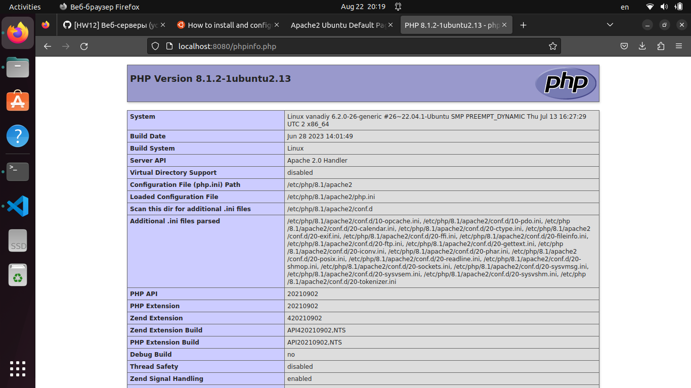
---

## 2. Установить на VM Nginx.
---
	vanadiy@vanadiy:~$ sudo apt-get nginx -y
---

## 3.Скопировать на VM папку https://github.com/tms-dos17-onl/_sandbox/tree/main/lecture15/react_nginx/build и настроить Nginx на хостинг этого веб-приложения. Проверить работоспособность приложения путем посещения всех доступных ссылок на главной странице и обновления каждой из страниц в веб-браузере.
---
	vanadiy@vanadiy:~$ grep -v ^# /etc/nginx/sites-available/build | cat

	server {
	listen 81 default_server;
	listen [::]:81 default_server;

	root /var/www/build;

	# Add index.php to the list if you are using PHP
	index index.html index.htm index.nginx-debian.html;

	server_name _;

	location / {
		# First attempt to serve request as file, then
		# as directory, then fall back to displaying a 404.
		try_files $uri $uri/ /index.html;
	}

	}
	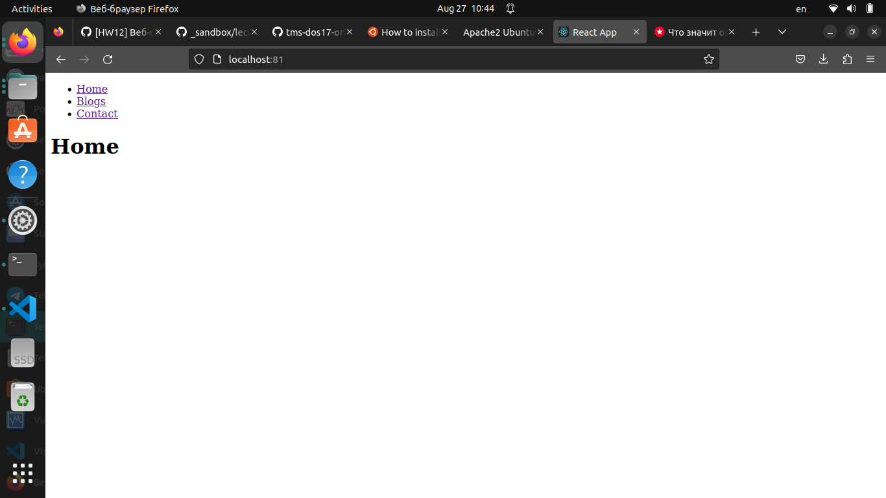	
---

## 4. Скопировать на VM папку https://github.com/tms-dos17-onl/_sandbox/tree/main/lecture15/api и запустить Python REST Api приложение согласно инструкции. Проверить работоспособность всех доступных REST Api методов с помощью Swagger.
---
	vanadiy@vanadiy:~$ cd /var/www/api/
	vanadiy@vanadiy:/var/www/api$ python3 main.py
	 * Serving Flask app 'main'
	 * Debug mode: on
	WARNING: This is a development server. Do not use it in a production deployment. Use a production WSGI server instead.
	 * Running on all addresses (0.0.0.0)
	 * Running on http://127.0.0.1:5000
	 * Running on http://192.168.100.7:5000
	Press CTRL+C to quit
	 * Restarting with stat
	 * Debugger is active!
	 * Debugger PIN: 113-755-260
	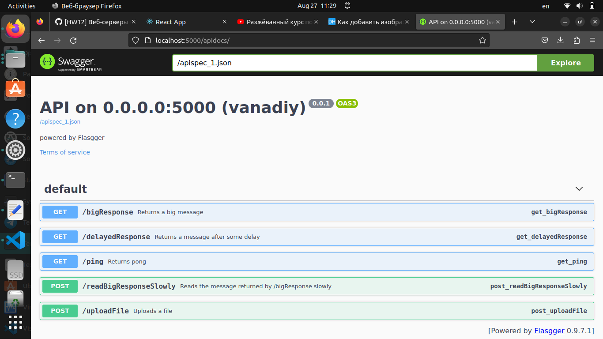
	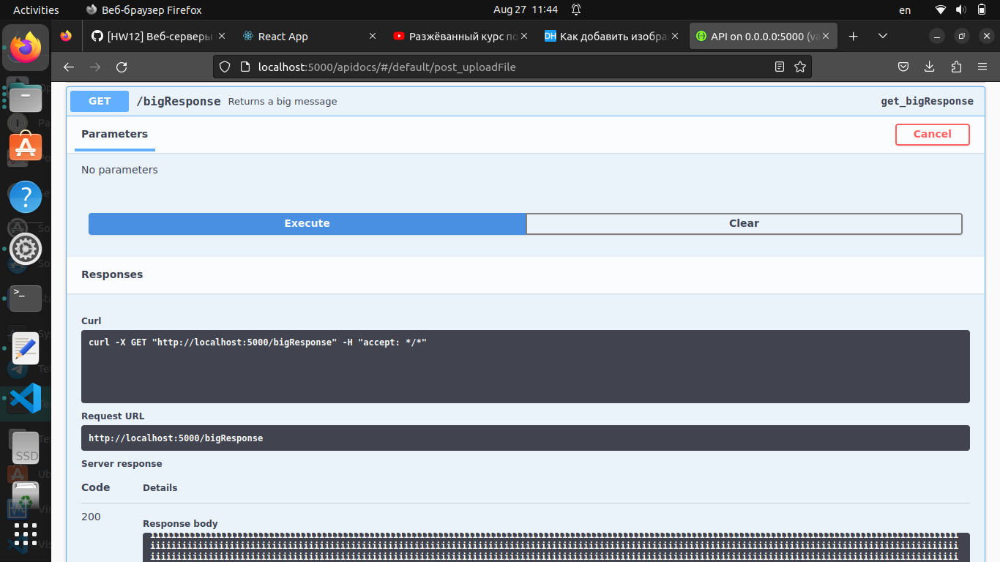
	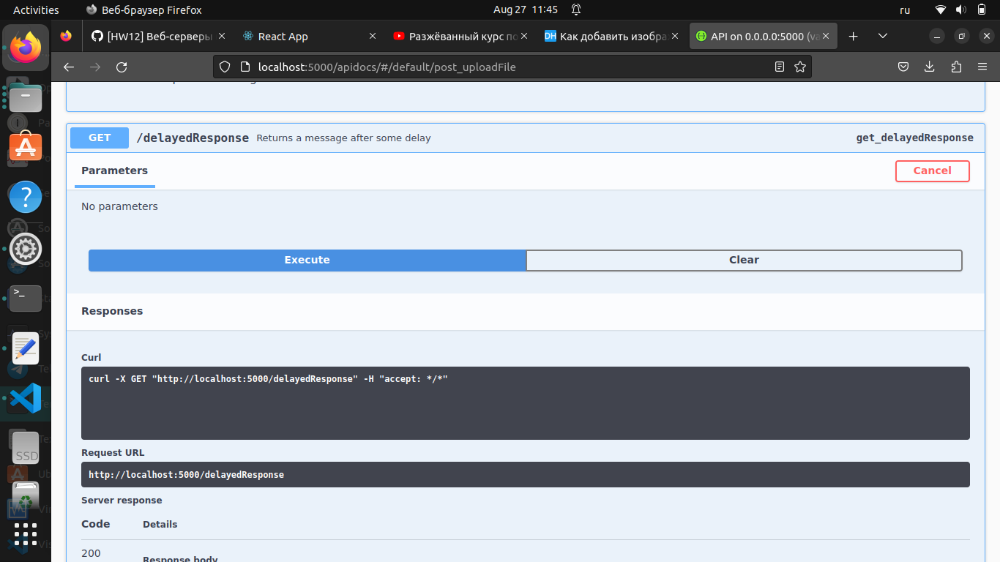
	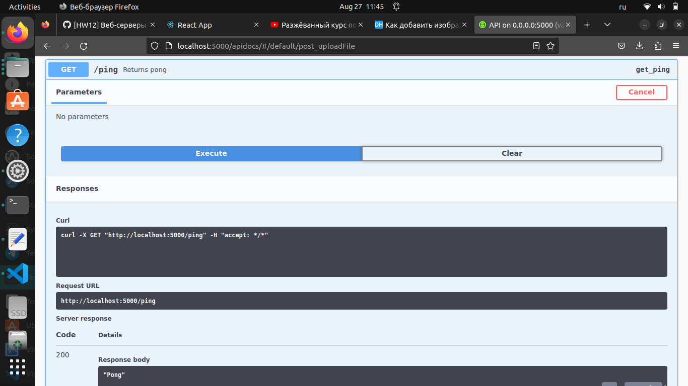
---

## 5. Настроить Nginx как Reverse Proxy для Python REST Api приложения из предыдущего пункта. А затем:
- Открыть Swagger для веб-приложения через Nginx (http://<NGINX_IP>:<NGINX_PORT>/apidocs).
- Проверить работоспособность всех доступных REST Api методов через Nginx с помощью Swagger. При необходимости поправить конфигурацию Nginx сервера, чтобы все методы работали.
- Для тестирования метода /uploadFile использовать файл размером больше 1MB.
- Вывести в консоль содержимое файла конфигурации Nginx с измененными значениями и комментариями.
---
vanadiy@vanadiy:~$ cat /etc/nginx/sites-available/api 
server {
	listen 85;
	listen [::]:85;

	root /var/www/api;
	
	proxy_read_timeout 300;
	proxy_connect_timeout 300;
	proxy_send_timeout 300;
	client_max_body_size 10M;

	# Add index.php to the list if you are using PHP
	#index index.html index.htm index.nginx-debian.html;

	server_name localhost;

	location / {
                proxy_pass      http://127.0.0.1:5000;
                proxy_set_header    Host $host;
                proxy_set_header    X-Real-IP $remote_addr;
                proxy_set_header    X-Forwarded-For $proxy_add_x_forwarded_for;
                proxy_set_header    X-Forwarded-Proto $scheme;
	}
	
	location /apidocs {
                proxy_pass              http://127.0.0.1:5000/apidocs/;
                proxy_set_header    Host $host;
                proxy_set_header    X-Real-IP $remote_addr;
                proxy_set_header    X-Forwarded-For $proxy_add_x_forwarded_for;
                proxy_set_header    X-Forwarded-Proto $scheme;
	}
}

	vanadiy@vanadiy:~$ fallocate -l 5M api.txt
	anadiy@vanadiy:~$ ls -lh api.txt 
	-rw-rw-r-- 1 vanadiy vanadiy 5.0M Aug 29 10:34 api.txt
	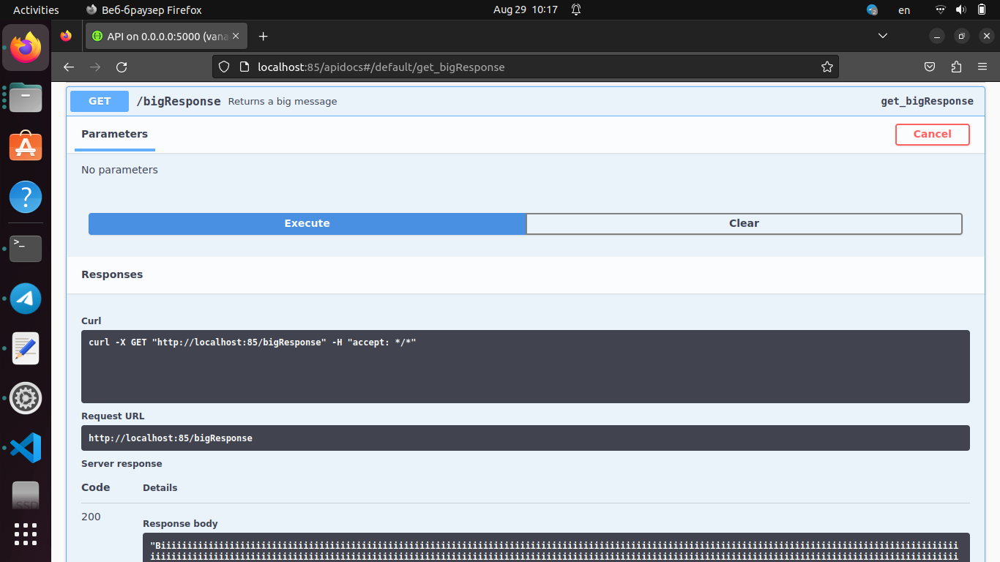
        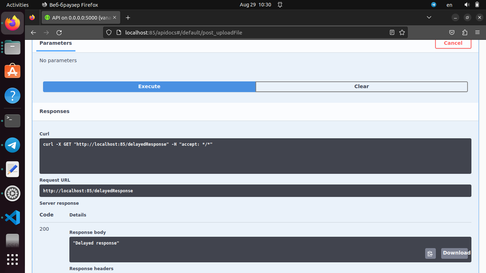
        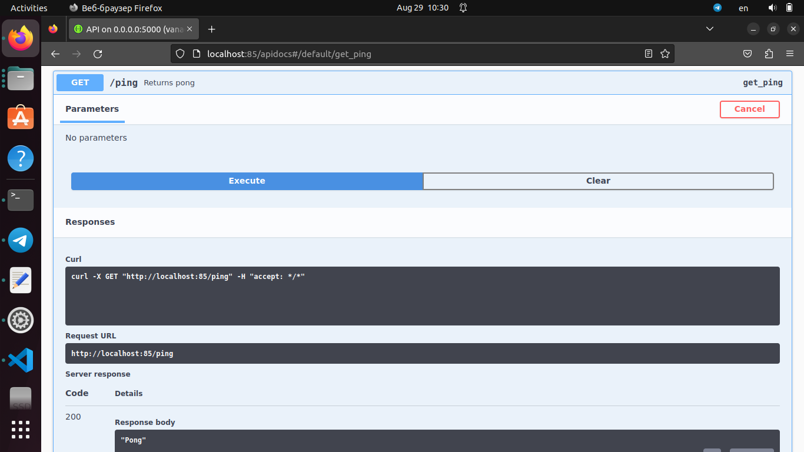
        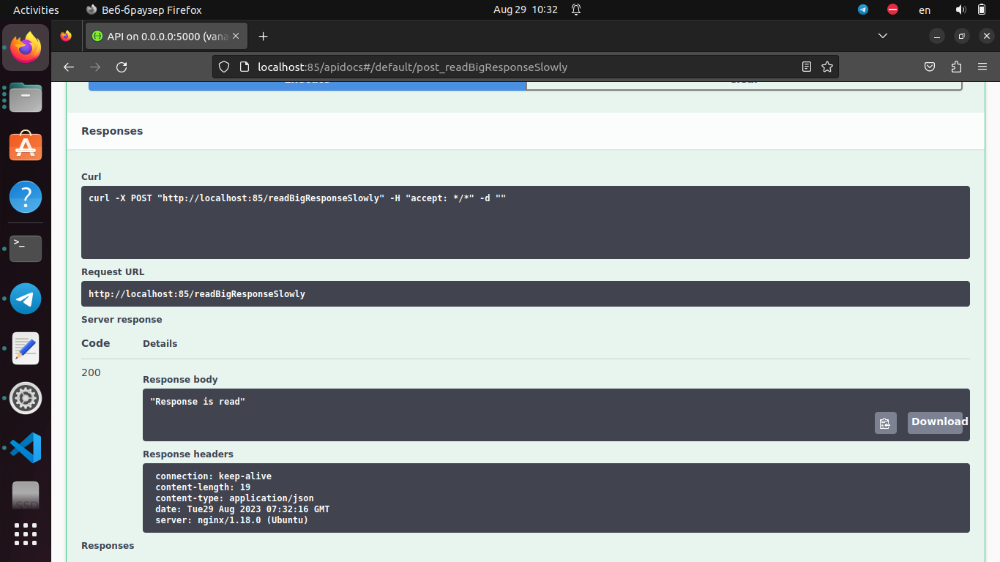
	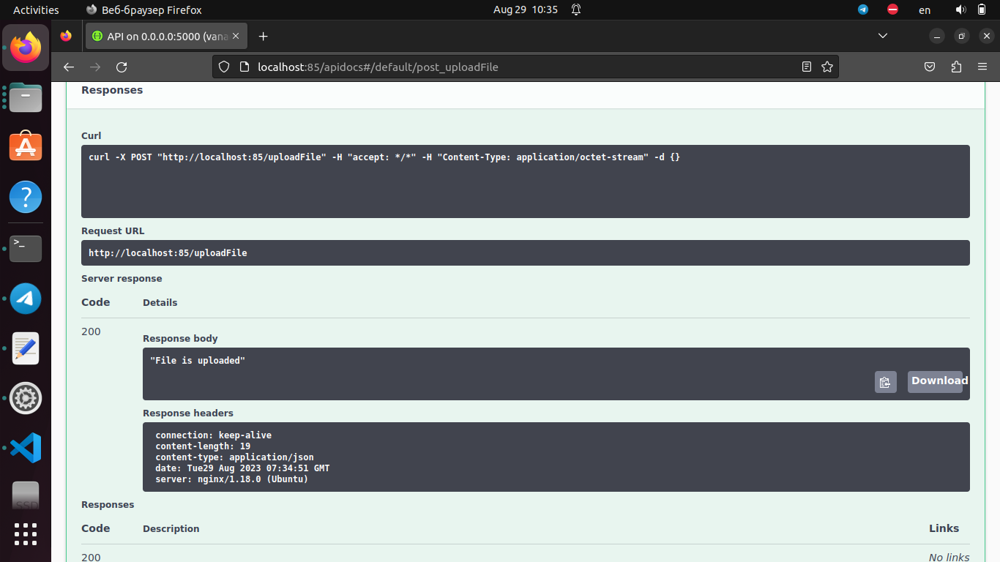
---
