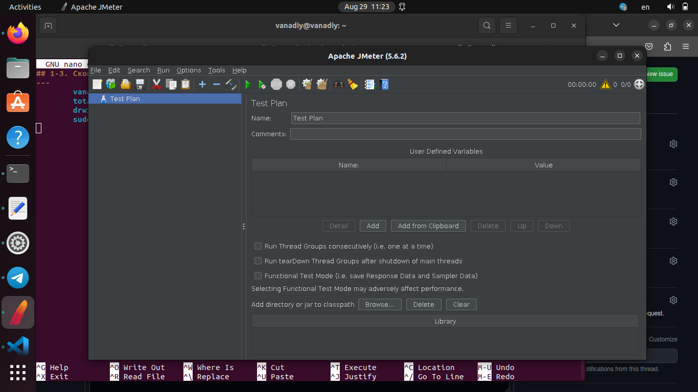
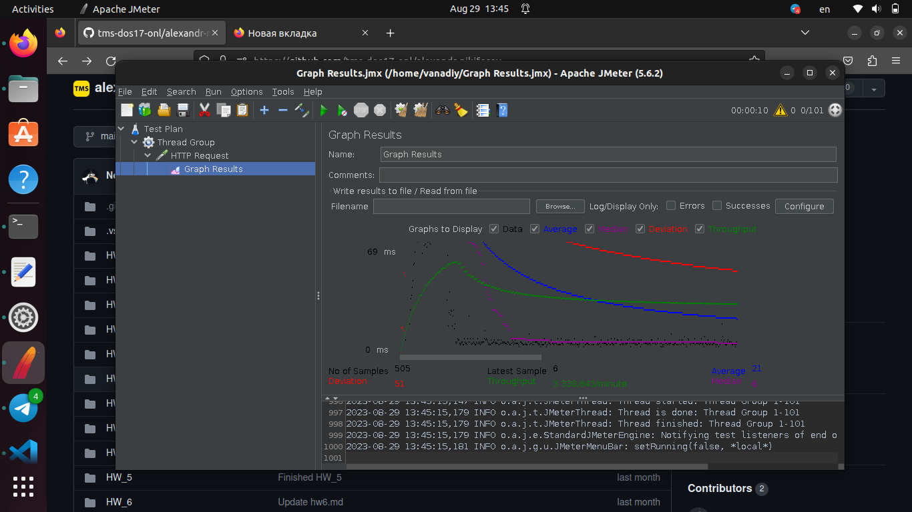
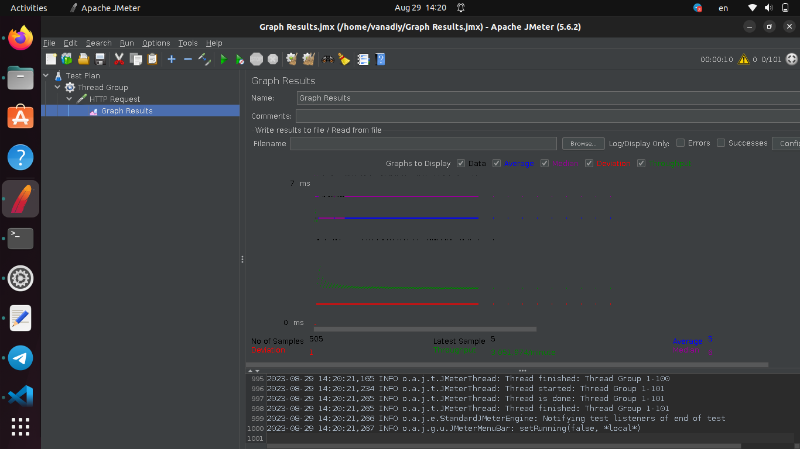

## 1-3. Скопировать папку https://github.com/tms-dos17-onl/_sandbox/tree/main/lecture15/api на VM и запустить Python REST Api приложение согласно инструкции. Проверить работоспособность всех доступных REST Api методов с помощью Swagger. Установить Nginx на VM и настроить его как Reverse Proxy для Python REST Api приложения из предыдущего пункта. Установить JMeter и написать тестовый сценарий для проверки производительности приложения путем выполнения HTTP GET запроса http://<NGINX_IP>:<NGINX_PORT>/ping от 100 пользователей.
---
	vanadiy@vanadiy:~$ ls -l /opt/
	total 4
	drwxr-xr-x 8 root root 4096 Jul 11 13:28 apache-jmeter-5.6.2
	sudo /opt/apache-jmeter-5.6.2/bin/jmeter.sh

---

## 4. Запустить ещё один экземпляр Python REST Api приложения на другом порту.
---
	vanadiy@vanadiy:/var/www/api$ python3 main.py 5001
	 * Serving Flask app 'main'
	 * Debug mode: on
	WARNING: This is a development server. Do not use it in a production deployment. Use a production WSGI server instead.
	 * Running on all addresses (0.0.0.0)
	 * Running on http://127.0.0.1:5001
	 * Running on http://172.20.10.4:5001
	Press CTRL+C to quit
	 * Restarting with stat
	 * Debugger is active!
	 * Debugger PIN: 441-977-640
---

## 5. Изменить конфигурацию Nginx, чтобы он использовал в качестве бэкенда 2 приложения.
---
	vanadiy@vanadiy:~$ cat /etc/nginx/sites-available/api
	upstream api {
	server 127.0.0.1:5000;
	server 127.0.0.1:5001;
	}

	server {
	listen 85;
	listen [::]:85;

	root /var/www/api;
	
	proxy_read_timeout 300;
	proxy_connect_timeout 300;
	proxy_send_timeout 300;
	client_max_body_size 10M;

	# Add index.php to the list if you are using PHP
	#index index.html index.htm index.nginx-debian.html;

	server_name localhost;

	location / {
                proxy_pass      http://api;
                proxy_set_header    Host $host;
                proxy_set_header    X-Real-IP $remote_addr;
                proxy_set_header    X-Forwarded-For $proxy_add_x_forwarded_for;
                proxy_set_header    X-Forwarded-Proto $scheme;
	}
	
	location /apidocs {
                proxy_pass              http://api/apidocs/;
                proxy_set_header    Host $host;
                proxy_set_header    X-Real-IP $remote_addr;
                proxy_set_header    X-Forwarded-For $proxy_add_x_forwarded_for;
                proxy_set_header    X-Forwarded-Proto $scheme;
	}
	}

---
