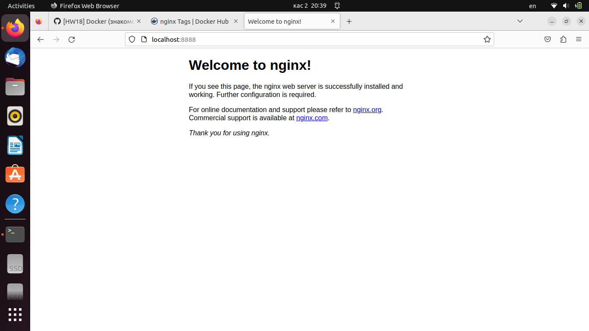
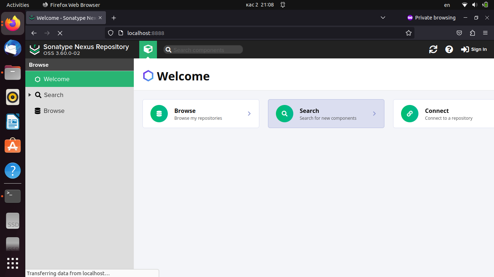
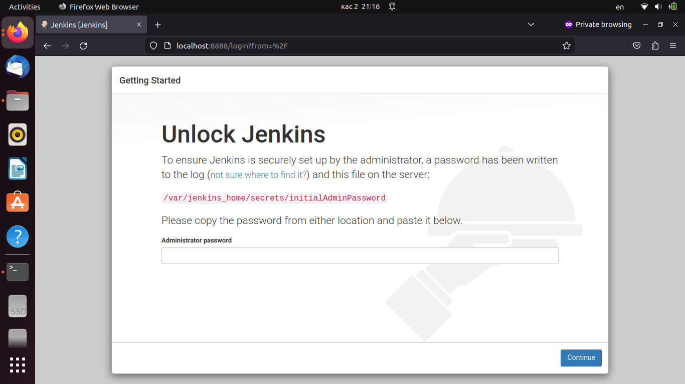
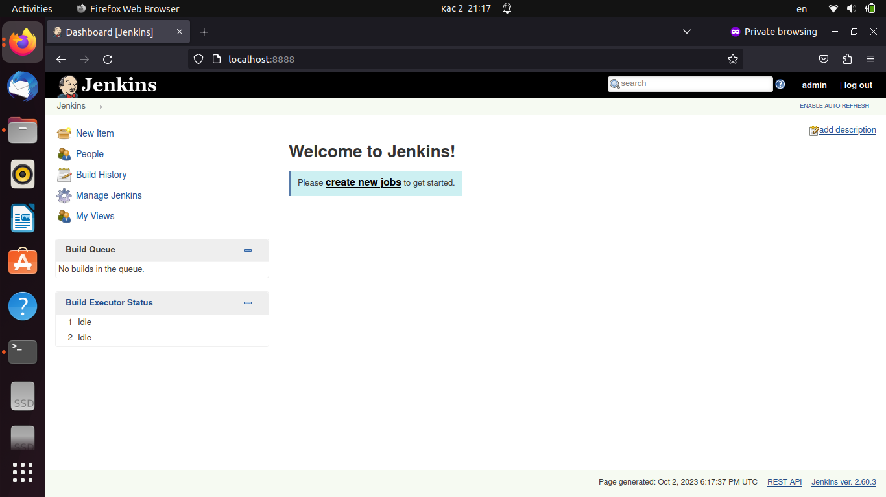

## 1. Установить Docker на хостовую ОС. В случае с Windows использовать WSL backend.
---
	vanadiy@vanadiy:~$ docker --version
	Docker version 24.0.6, build ed223bc
---

## 2. Убедиться, что Docker работает исправно путем запуска контейнера hello-world.
---
	vanadiy@vanadiy:~$ docker run hello-world
	Unable to find image 'hello-world:latest' locally
	latest: Pulling from library/hello-world
	719385e32844: Pull complete 
	Digest: sha256:4f53e2564790c8e7856ec08e384732aa38dc43c52f02952483e3f003afbf23db
	Status: Downloaded newer image for hello-world:latest

	Hello from Docker!
	This message shows that your installation appears to be working correctly.

	To generate this message, Docker took the following steps:
	 1. The Docker client contacted the Docker daemon.
	 2. The Docker daemon pulled the "hello-world" image from the Docker Hub.
	    (amd64)
	 3. The Docker daemon created a new container from that image which runs the
	    executable that produces the output you are currently reading.
	 4. The Docker daemon streamed that output to the Docker client, which sent it
	    to your terminal.

	To try something more ambitious, you can run an Ubuntu container with:
	 $ docker run -it ubuntu bash
	
	Share images, automate workflows, and more with a free Docker ID:
	 https://hub.docker.com/

	For more examples and ideas, visit:
	 https://docs.docker.com/get-started/
---

## 3. Установить Nginx используя Docker образ
---
	vanadiy@vanadiy:~$ docker pull nginx
	Using default tag: latest
	latest: Pulling from library/nginx
	a803e7c4b030: Pull complete 
	8b625c47d697: Pull complete 
	4d3239651a63: Pull complete 
	0f816efa513d: Pull complete 
	01d159b8db2f: Pull complete 
	5fb9a81470f3: Pull complete 
	9b1e1e7164db: Pull complete 
	Digest: sha256:32da30332506740a2f7c34d5dc70467b7f14ec67d912703568daff790ab3f755
	Status: Downloaded newer image for nginx:latest
	docker.io/library/nginx:latest
	vanadiy@vanadiy:~$ docker run -d --rm -it -p 8888:80 nginx
	543af66c0e1ca967eb4776b8632da68bac7e78994ed96d280dee57be60e342a8
	vanadiy@vanadiy:~$ docker ps
	CONTAINER ID   IMAGE     COMMAND                  CREATED          STATUS         PORTS                                   NAMES
	543af66c0e1c   nginx     "/docker-entrypoint.…"   14 seconds ago   Up 8 seconds   0.0.0.0:8888->80/tcp, :::8888->80/tcp   stupefied_ellis

---

## 4. Изучить следующие команды и их флаги:
- docker run (-i, -t, -d, --rm)
- docker ps (-a, -l, -q)
- docker images
- docker start/docker stop/docker restart
- docker exec
---
	

    run - запуск контейнера;

    -i - интерактивный режим;

    -t - сессия в терминале;

    -d - работа как демон;

    --rm - автоматическое удаление контейнера при выходе;

    ps 

    -a - показывает список всех контейнеров, в том числе завершивших работу;

    -l - показывает последний запущенный контейнер;

    -q - показывает только id контейнеров;

    docker images - список контейнеров в локальном репозитории

    docker start - старт остановленных контейнеров

    docker stop - остановка контейнеров

    docker restart - перезапуск контейнеров

    docker exec - выполнение комаед в запущенном контейнере
---

## 5. Установить Nexus используя Docker образ
---
	vanadiy@vanadiy:~$ docker pull sonatype/nexus3
	Using default tag: latest
	latest: Pulling from sonatype/nexus3
	57168402cb72: Pull complete 
	6caa094755dc: Pull complete 
	94656dc36e5f: Pull complete 
	252d91e5c44e: Pull complete 
	0100fe0780d1: Pull complete 
	12a0cb9b1e42: Pull complete 
	cd872a505f36: Pull complete 
	Digest: sha256:a361830ede036ac2f4942464b1c9ca535cbfcba14c5d3237b0d378fcfee1f3ec
	Status: Downloaded newer image for sonatype/nexus3:latest
	docker.io/sonatype/nexus3:latest
	vanadiy@vanadiy:~$ docker run -d --rm -p 8081:8081 sonatype/nexus3
	fe5a2c7d5fbfafd2f0d821cb18a243a2603a8dadadbb058dd69538ae0ff6886a
	vanadiy@vanadiy:~$ docker ps
	CONTAINER ID   IMAGE             COMMAND                  CREATED          STATUS          PORTS                                       NAMES
	fe5a2c7d5fbf   sonatype/nexus3   "/opt/sonatype/nexus…"   19 seconds ago   Up 16 seconds   0.0.0.0:8081->8081/tcp, :::8081->8081/tcp   amazing_mestorf

---

## 6. Установить Jenkins используя Docker образ
---
	vanadiy@vanadiy:~$ docker pull jenkins:2.60.3
	2.60.3: Pulling from library/jenkins
	55cbf04beb70: Pull complete 
	1607093a898c: Pull complete 
	9a8ea045c926: Pull complete 
	d4eee24d4dac: Pull complete 
	c58988e753d7: Pull complete 
	794a04897db9: Pull complete 
	70fcfa476f73: Pull complete 
	0539c80a02be: Pull complete 
	54fefc6dcf80: Pull complete 
	911bc90e47a8: Pull complete 
	38430d93efed: Pull complete 
	7e46ccda148a: Pull complete 
	c0cbcb5ac747: Pull complete 
	35ade7a86a8e: Pull complete 
	aa433a6a56b1: Pull complete 
	841c1dd38d62: Pull complete 
	b865dcb08714: Pull complete 
	5a3779030005: Pull complete 
	12b47c68955c: Pull complete 
	1322ea3e7bfd: Pull complete 
	Digest: sha256:eeb4850eb65f2d92500e421b430ed1ec58a7ac909e91f518926e02473904f668
	Status: Downloaded newer image for jenkins:2.60.3
	docker.io/library/jenkins:2.60.3
	vanadiy@vanadiy:~$ docker run -d --rm -it -p 8888:8080 jenkins:2.60.3
	1efd88e88fd86c296ce749ba99bbadff71e0cabd63176e427794f9beb89e2dfd
	vanadiy@vanadiy:~$ docker ps
	CONTAINER ID   IMAGE            COMMAND                  CREATED          STATUS         PORTS                                                  NAMES
	1efd88e88fd8   jenkins:2.60.3   "/bin/tini -- /usr/l…"   11 seconds ago   Up 6 seconds   50000/tcp, 0.0.0.0:8888->8080/tcp, :::8888->8080/tcp   heuristic_easley
	vanadiy@vanadiy:~$ docker exec -it 1efd88e88fd8 bash
	jenkins@1efd88e88fd8:/$ cat /var/jenkins_home/secrets/initialAdminPassword
	61f7fccbaf1f44f38a14c037d806f62d

---

