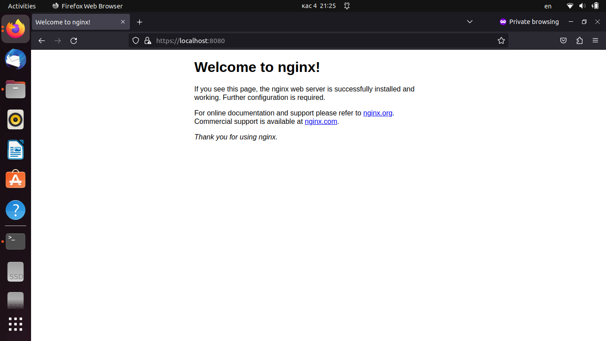

## 1. Установить Nginx и смонтировать в него:
- конфигурационный файл с хоста, который выполняет настройку HTTPS для страницы по умолчанию
- директорию с сертификатами
---
	vanadiy@vanadiy:~$ docker run -d --rm -it -p 8080:443 -v /home/vanadiy/nginx_docker/nginx_docker.conf:/etc/nginx/conf.d/default.conf -v /home/vanadiy/nginx_ca://usr/certs nginx
	vanadiy@vanadiy:~$ cat ./nginx_docker/nginx_docker.conf 
    server {

    listen 443 ssl;
    listen [::]:443 ssl;

    ssl_certificate     /usr/certs/public-nginx.pem;
    ssl_certificate_key /usr/certs/private.pem;

    root /usr/share/nginx/html;

    index index.html;

    server_name _;

    location / {
        try_files $uri $uri/ /index-debian.html;
    }
    }

---

## 2. Запустить 2 Docker контейнера (например, Docker Getting Started и netshoot) с настройками сети по умолчанию и проверить есть ли между ними соединение.
---
	vanadiy@vanadiy:~$ docker run -d --rm -p 80:80 docker/getting-started
	docker run -it --rm nicolaka/netshoot
	vanadiy@vanadiy:~$ docker ps
	CONTAINER ID   IMAGE                    COMMAND                  CREATED          STATUS          PORTS                               NAMES
	e2aaa4c53442   nicolaka/netshoot        "zsh"                    17 minutes ago   Up 17 minutes                                       stupefied_sutherland
	c0300afa6fae   docker/getting-started   "/docker-entrypoint.…"   20 minutes ago   Up 20 minutes   0.0.0.0:80->80/tcp, :::80->80/tcp   cool_villani
	vanadiy@vanadiy:~$ docker exec c0300afa6fae ip a
	1: lo: <LOOPBACK,UP,LOWER_UP> mtu 65536 qdisc noqueue state UNKNOWN qlen 1000
    link/loopback 00:00:00:00:00:00 brd 00:00:00:00:00:00
    inet 127.0.0.1/8 scope host lo
       valid_lft forever preferred_lft forever
	33: eth0@if34: <BROADCAST,MULTICAST,UP,LOWER_UP,M-DOWN> mtu 1500 qdisc noqueue state UP 
    link/ether 02:42:ac:11:00:02 brd ff:ff:ff:ff:ff:ff
    inet 172.17.0.2/16 brd 172.17.255.255 scope global eth0
       valid_lft forever preferred_lft forever
	 e2aaa4c53442  ~  ip a
	1: lo: <LOOPBACK,UP,LOWER_UP> mtu 65536 qdisc noqueue state UNKNOWN group default qlen 1000
    link/loopback 00:00:00:00:00:00 brd 00:00:00:00:00:00
    inet 127.0.0.1/8 scope host lo
       valid_lft forever preferred_lft forever
	35: eth0@if36: <BROADCAST,MULTICAST,UP,LOWER_UP> mtu 1500 qdisc noqueue state UP group default 
    link/ether 02:42:ac:11:00:03 brd ff:ff:ff:ff:ff:ff link-netnsid 0
    inet 172.17.0.3/16 brd 172.17.255.255 scope global eth0
       valid_lft forever preferred_lft forever

	 e2aaa4c53442  ~  ping 172.17.0.2
	PING 172.17.0.2 (172.17.0.2) 56(84) bytes of data.
	64 bytes from 172.17.0.2: icmp_seq=1 ttl=64 time=0.287 ms
	64 bytes from 172.17.0.2: icmp_seq=2 ttl=64 time=0.148 ms
	64 bytes from 172.17.0.2: icmp_seq=3 ttl=64 time=0.178 ms
	64 bytes from 172.17.0.2: icmp_seq=4 ttl=64 time=0.163 ms
	64 bytes from 172.17.0.2: icmp_seq=5 ttl=64 time=0.180 ms
	64 bytes from 172.17.0.2: icmp_seq=6 ttl=64 time=0.181 ms
	64 bytes from 172.17.0.2: icmp_seq=7 ttl=64 time=0.160 ms
	64 bytes from 172.17.0.2: icmp_seq=8 ttl=64 time=0.187 ms
	64 bytes from 172.17.0.2: icmp_seq=9 ttl=64 time=0.179 ms
	64 bytes from 172.17.0.2: icmp_seq=10 ttl=64 time=0.171 ms
---

## 3. Создать именованный Docker volume, который будет использоваться для хранения данных MariaDB. Установить MariaDB версии 11.0 используя ранее созданный volume. Затем:
- Запустить интерактивную сессию Bash в запущенном контейнере при помощи docker exec
- Проверить версию MariaDB через SQL запрос.
- Создать БД, таблицу и запись.
- Выполнить апгрейд MariaDB путем подмены версии используемого Docker образа на 11.1.2.
- Проверить, что версия MariaDB поменялась.
- Проверить, что данные остались.
---
	vanadiy@vanadiy:~$ docker pull mariadb:11.0
	11.0: Pulling from library/mariadb
	707e32e9fc56: Pull complete 
	4e342cc0fc32: Pull complete 
	8c036f60ad2b: Pull complete 
	bb0246c52237: Pull complete 
	9c5548ae0068: Pull complete 
	8b7160eb2cb7: Pull complete 
	8b8730877b64: Pull complete 
	1b24418ed769: Pull complete 
	Digest: sha256:ad1fa661c302f1c1b36d929295aac62ae011fb588ad695d7f9823edac9fddd0c
	Status: Downloaded newer image for mariadb:11.0
	docker.io/library/mariadb:11.0
	vanadiy@vanadiy:~$ docker run -d --rm --name mariadb -v my_mariadb_data:/var/lib/mysql --env MARIADB_USER=vanadiy --env MARIADB_PASSWORD=11111111 --env MARIADB_ROOT_PASSWORD=11111111  mariadb:11.0
	f6a39dd3f5c5f90609d2156d9b7dea5df4bcb4c0e1ab603d83631f9553c80f16
	vanadiy@vanadiy:~$ docker exec -it f6a39dd3f5c5 bash
	root@f6a39dd3f5c5:/# mariadb -uroot -p
	Enter password: 
	Welcome to the MariaDB monitor.  Commands end with ; or \g.
	Your MariaDB connection id is 3
	Server version: 11.0.3-MariaDB-1:11.0.3+maria~ubu2204 mariadb.org binary distribution

	Copyright (c) 2000, 2018, Oracle, MariaDB Corporation Ab and others.

	Type 'help;' or '\h' for help. Type '\c' to clear the current input statement.

	MariaDB [(none)]> select version();
	+---------------------------------------+
	| version()                             |
	+---------------------------------------+
	| 11.0.3-MariaDB-1:11.0.3+maria~ubu2204 |
	+---------------------------------------+
	1 row in set (0.001 sec)
	MariaDB [(none)]> create database vanadiy;
	Query OK, 1 row affected (0.001 sec)
	MariaDB [(none)]> use vanadiy;
	Database changed
	MariaDB [vanadiy]> create table vanadiy (Id INT, Name VARCHAR(20));
	Query OK, 0 rows affected (0.229 sec)

	MariaDB [vanadiy]> insert into vanadiy (Id, Name) value(1, 'Vladimir');
	Query OK, 1 row affected (0.059 sec)

	MariaDB [vanadiy]> select * from vanadiy
	    -> ;
	+------+----------+
	| Id   | Name     |
	+------+----------+
	|    1 | Vladimir |
	+------+----------+
	1 row in set (0.001 sec)
	vanadiy@vanadiy:~$ docker pull mariadb:11.1.2
	11.1.2: Pulling from library/mariadb
	707e32e9fc56: Already exists 
	4e342cc0fc32: Already exists 
	8c036f60ad2b: Already exists 
	bb0246c52237: Already exists 
	6b97cd52094f: Pull complete 
	cab8d5a2ab07: Pull complete 
	17f95f76179d: Pull complete 
	3e8199e03ff8: Pull complete 
	Digest: sha256:77e8ad8ae65e4bf59da8e0c078a086fce71a5cff21ae3c72e55573f3fde33580
	Status: Downloaded newer image for mariadb:11.1.2
	docker.io/library/mariadb:11.1.2
	vanadiy@vanadiy:~$ docker ps
	CONTAINER ID   IMAGE          COMMAND                  CREATED          STATUS          PORTS      NAMES
	f6a39dd3f5c5   mariadb:11.0   "docker-entrypoint.s…"   18 minutes ago   Up 18 minutes   3306/tcp   mariadb
	vanadiy@vanadiy:~$ docker stop f6
	f6
	vanadiy@vanadiy:~$ docker run -d --rm --name mariadb -v my_mariadb_data:/var/lib/mysql --env MARIADB_USER=vanadiy --env MARIADB_PASSWORD=11111111 --env MARIADB_ROOT_PASSWORD=11111111  mariadb:11.1.2
	82a0bde5bee67fd1b477b0f2bc611b7579ae91f1adab9d29a6c5210d9a52442e
	vanadiy@vanadiy:~$ docker ps
	CONTAINER ID   IMAGE            COMMAND                  CREATED         STATUS         PORTS      NAMES
	82a0bde5bee6   mariadb:11.1.2   "docker-entrypoint.s…"   5 seconds ago   Up 2 seconds   3306/tcp   mariadb
	vanadiy@vanadiy:~$ docker exec -it 82 bash
	root@82a0bde5bee6:/# mariadb -uroot -p
	Enter password: 
	Welcome to the MariaDB monitor.  Commands end with ; or \g.
	Your MariaDB connection id is 3
	Server version: 11.1.2-MariaDB-1:11.1.2+maria~ubu2204 mariadb.org binary distribution

	Copyright (c) 2000, 2018, Oracle, MariaDB Corporation Ab and others.

	Type 'help;' or '\h' for help. Type '\c' to clear the current input statement.

	MariaDB [(none)]> select version();
	+---------------------------------------+
	| version()                             |
	+---------------------------------------+
	| 11.1.2-MariaDB-1:11.1.2+maria~ubu2204 |
	+---------------------------------------+
	1 row in set (0.001 sec)

	MariaDB [(none)]> use vanadiy;
	Reading table information for completion of table and column names
	You can turn off this feature to get a quicker startup with -A

	Database changed
	MariaDB [vanadiy]> select * from vanadiy
	    -> ;
	+------+----------+
	| Id   | Name     |
	+------+----------+
	|    1 | Vladimir |
	+------+----------+
	1 row in set (0.002 sec)
---
	
