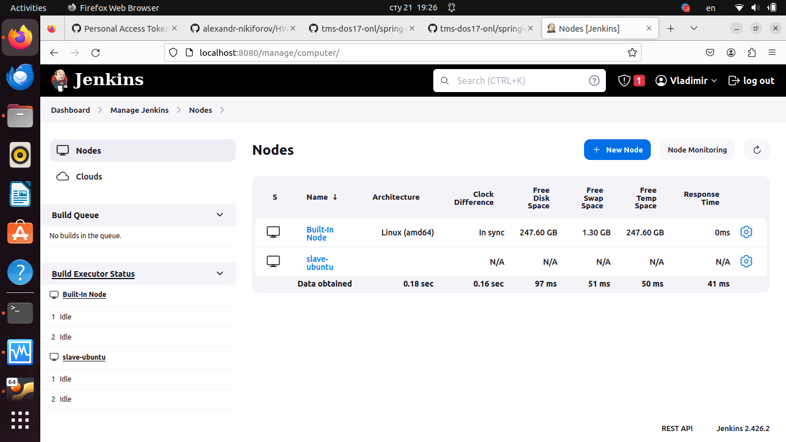
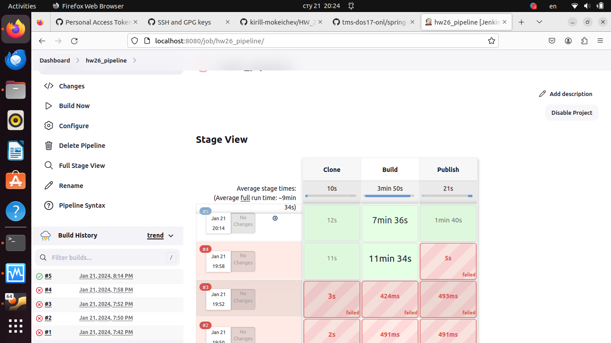
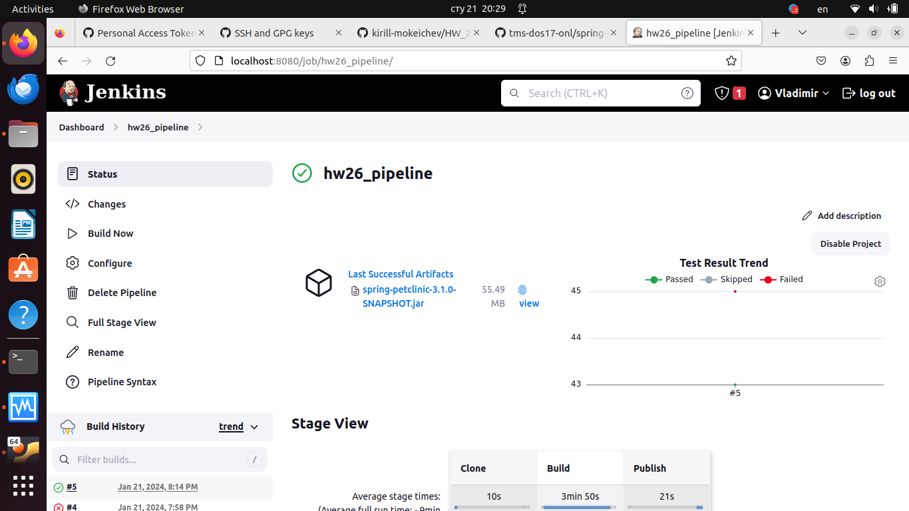

## 1.Познакомиться с описанием проекта spring-petclinic, изучить какие инструменты нужны для его сборки.
---
	познакомился
---

## 2. Создать статический Jenkins агент (можно использовать WSL), установить туда инструменты, необходимые для сборки проекта.
---

---

## 3.Реализовать Jenkinsfile для проекта, который состоит из следующих этапов (stages):
- Clone
- Клонируется данный проект. Обратите внимание, что этот репозиторий приватный и для того, чтобы его склонировать нужно использовать какие-то credentials. Необходимо создать нужные credentials в Jenkins и сослаться на них при написании pipeline.
- Build
- Происходит сборка проекта через Maven или Gradle и запускаются юнит-тесты.
- Publish
- Публикуется артефакт сборки с помощью инструкции archiveArtifacts.
- Публикуется отчёт тестирования с помощью инструкции junit.
---
	pipeline {
    agent { label 'slave1' } 
       stages {
        stage('Clone') {
            steps {
               sh "rm -rf ./*"
               sh "git clone git@github.com:tms-dos17-onl/spring-petclinic.git"
                }
        }
        stage('Build') {
            steps {
               sh "whoami"
               sh "/home/jenkins-worker/workspace/hw26_pipeline/spring-petclinic/mvnw package -f /home/jenkins-worker/workspace/hw26_pipeline/spring-petclinic/pom.xml "
            }
        }
        
        stage('Publish') {
            steps {
                junit 'spring-petclinic/target/surefire-reports/*.xml'
                archiveArtifacts artifacts: "spring-petclinic/target/*.jar", fingerprint: true
            }
        }
    }
}

---

## 4. Настроить сборку по расписанию (каждый час) при помощи блока triggers в Jenkinsfile.
---
	triggers {
        cron "0 * * * *"
---
