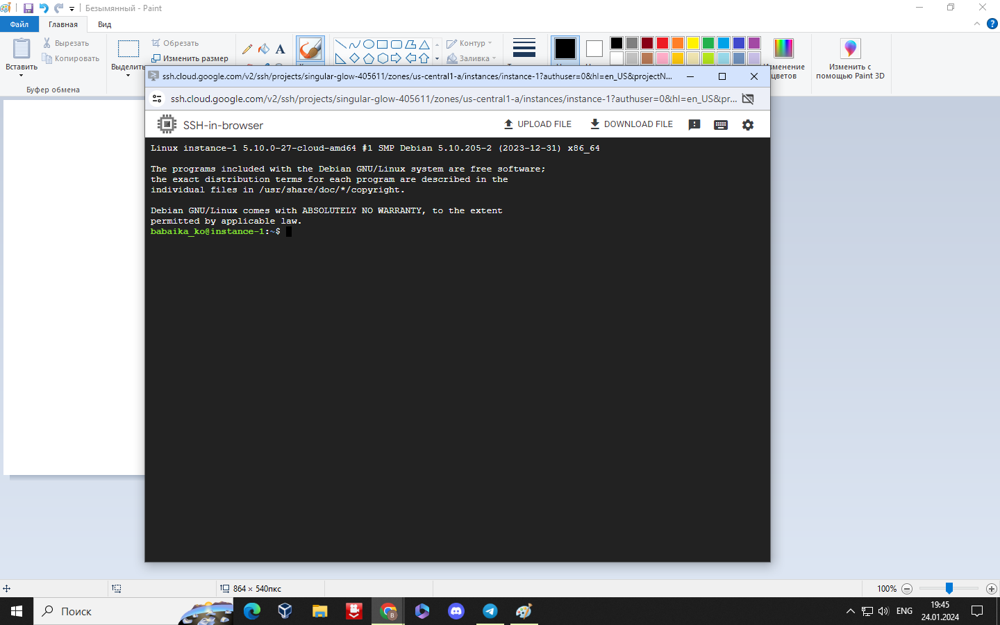
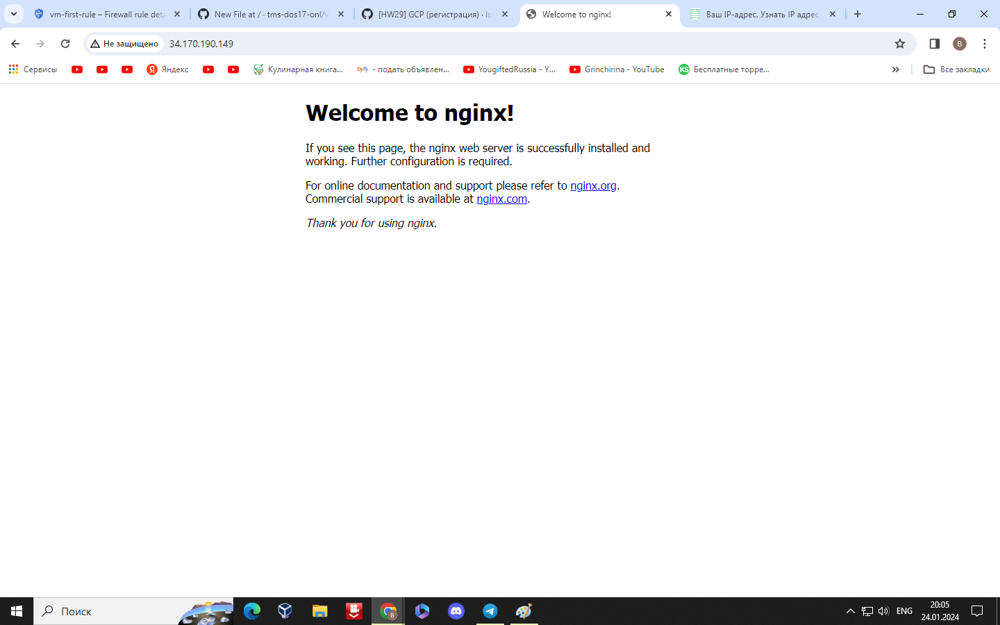

## 1. Зарегистрироваться на облачном провайдере Google Cloud Platform (GCP)
- В качестве локации указать Грузию.
- Привязать банковскую карту РБ/РФ.
- Получить кредиты от GCP (300$) путем верификации карты.
---
  типо зарегистрировался
  ---
  ## 2. Настроить предупреждения для бюджета (например, 50$ на месяц).
  ## 3.  Создать свою первую VM в облаке, зайти на неё по SSH и установить Nginx/Apache.

---
      babaika_ko@instance-1:~$ systemctl status nginx.service 
      ● nginx.service - A high performance web server and a reverse proxy server
       Loaded: loaded (/lib/systemd/system/nginx.service; enabled; vendor preset: enabled)
       Active: active (running) since Wed 2024-01-24 16:47:49 UTC; 1min 28s ago
         Docs: man:nginx(8)
      Process: 1461 ExecStartPre=/usr/sbin/nginx -t -q -g daemon on; master_process on; (code=exited, status=0/S>
      Process: 1462 ExecStart=/usr/sbin/nginx -g daemon on; master_process on; (code=exited, status=0/SUCCESS)
     Main PID: 1652 (nginx)
        Tasks: 3 (limit: 4691)
       Memory: 5.7M
          CPU: 37ms
       CGroup: /system.slice/nginx.service
               ├─1652 nginx: master process /usr/sbin/nginx -g daemon on; master_process on;
               ├─1655 nginx: worker process
               └─1656 nginx: worker process
---
  ## 4. Создать Firewall правило для подключения к этой VM со своей локальной машины по порту 80. Проверить, что доступ работает.
  ---

  ---
