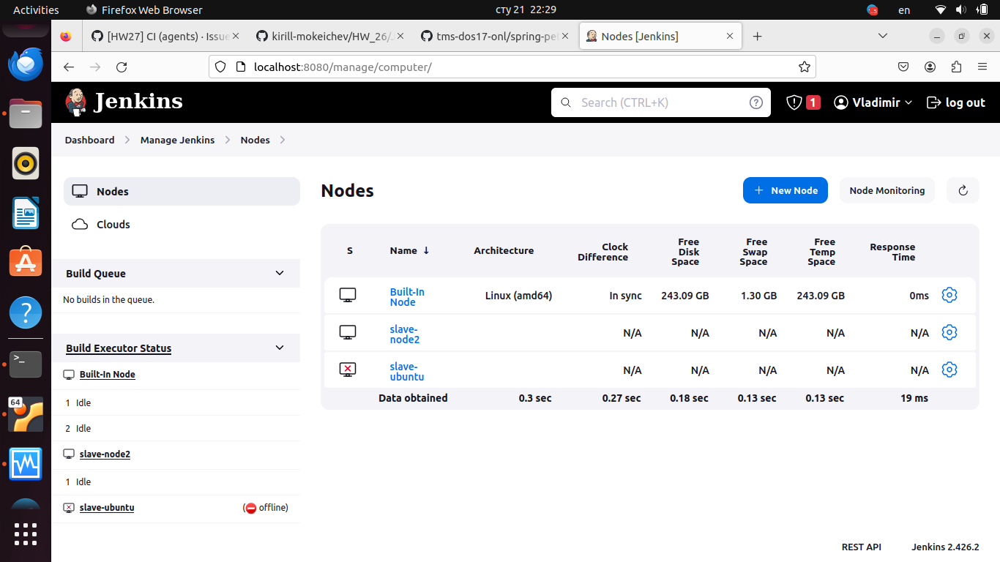

## 1. Создать новый Jenkins агент и установить на нём Docker.
---

---

## 2. Изменить Jenkinsfile из предыдущего домашнего задания путём добавления стадии "Integration Tests" между стадиями Build и Publish. Она должна запускаться в Docker контейнере на созданном ранее Jenkins агенте при помощи Docker Pipeline плагина и выполнять следующие шаги:
- Запуск приложения в фоновом режиме.
- Проверка работоспособности приложения при помощи curl.

Для передачи артефактов между агентами использовать stash/unstash.
---
	pipeline {
    agent none
    stages {
        stage('Clone & Build') {
            agent {
                 label 'slave2'
            }
            steps {
                sh 'rm -rf *'
                sh 'git clone https://github.com/spring-projects/spring-petclinic.git'
                sh 'spring-petclinic/mvnw package -f spring-petclinic/pom.xml'
                sh 'ls -la'
                sh 'pwd'
                stash includes: 'spring-petclinic/target/*.jar', name: 'jar'
                stash includes: 'spring-petclinic/target/surefire-reports/*.xml', name: 'report'
            }
        }
        stage('Integration Tests')  {
            agent {
                docker {
                    label 'master'
                    image 'openjdk:17'
                }
            }
            steps {
                unstash name: 'jar'
                sh 'ls -la'
                sh 'java -jar spring-petclinic/target/spring-petclinic-3.2.0-SNAPSHOT.jar &'                
                sh 'sleep 20'
            }
        }
        stage('Publish') {
            agent any
            steps {
                unstash name: 'jar'                
                unstash name: 'report'
                archiveArtifacts artifacts: 'spring-petclinic/target/*.jar'
                junit 'spring-petclinic/target/surefire-reports/*.xml'
            }
        }
    }
    }
---
