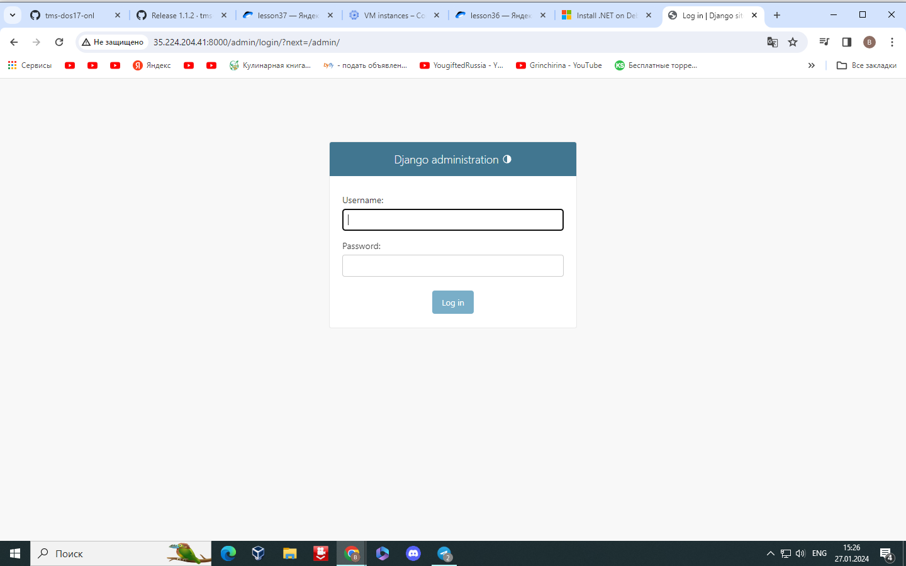
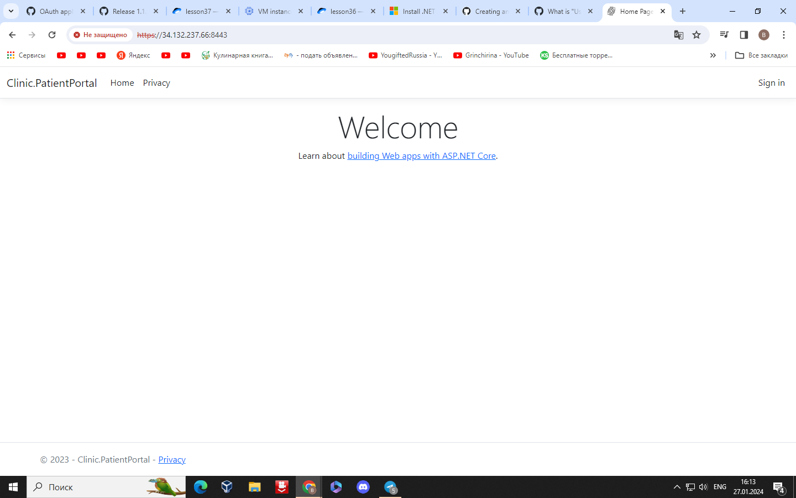
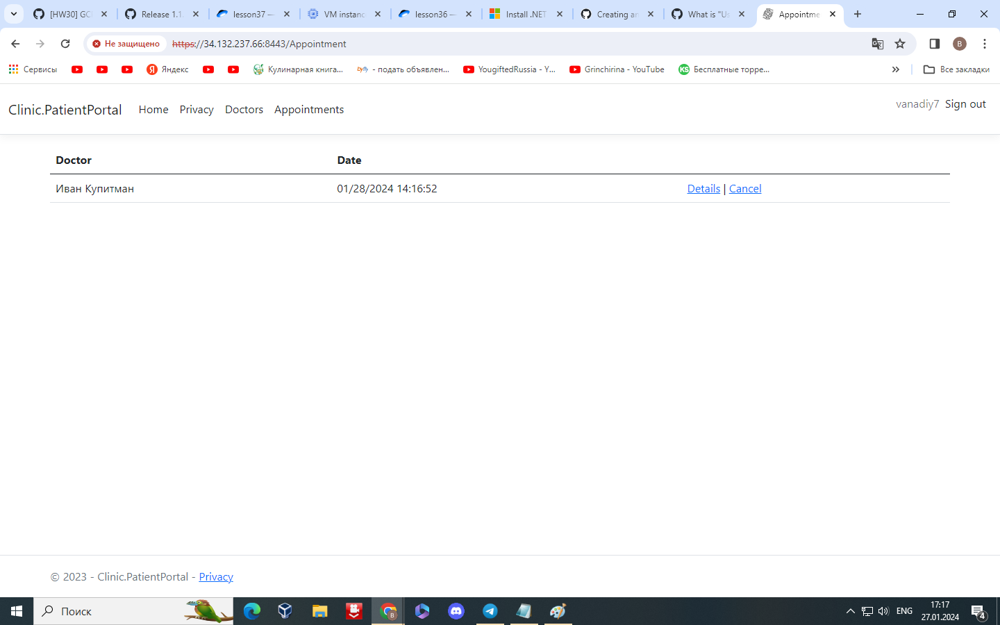

## Установить приложение Clinic v1 в Google Cloud Platform согласно инструкции. Для хостинга БД использовать Google Cloud SQL поддержкой соединений только во внутренней сети (иными словами, БД будет доступна только по внутреннему/приватному IP). Сами сервисы установить на виртуальные машины Google Compute Engine (GCE) с ОС Debian 12. Проверить работоспособность приложения путём создания записи на приём к любому врачу.

