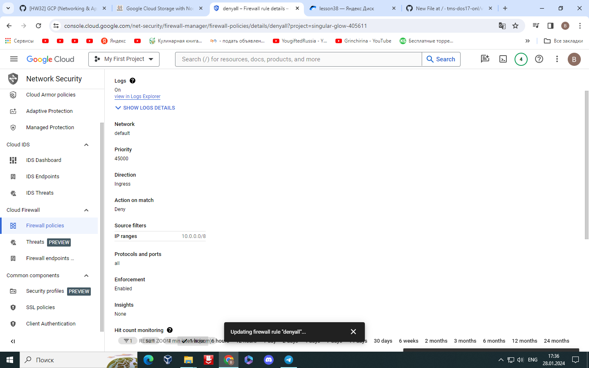
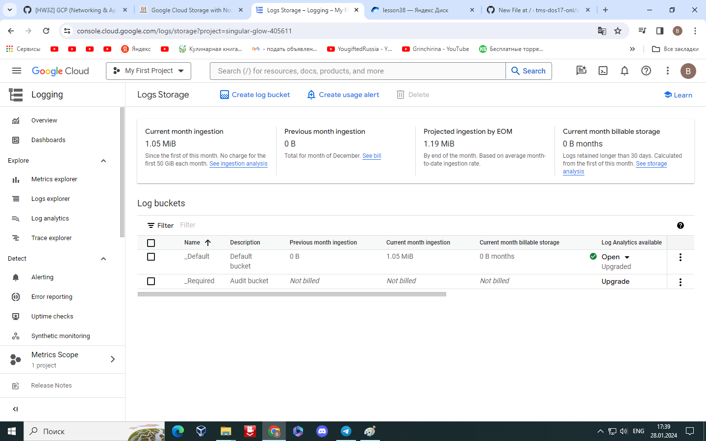
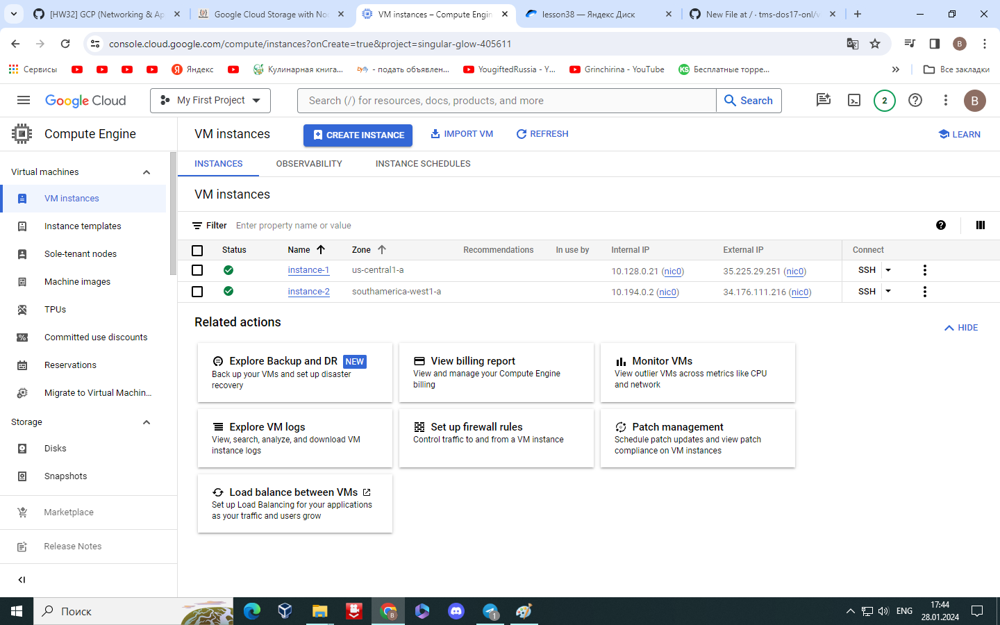
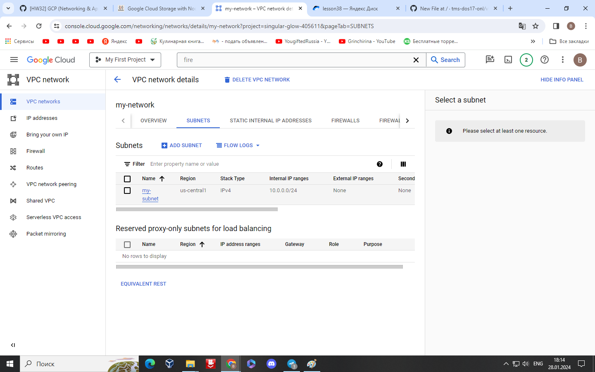
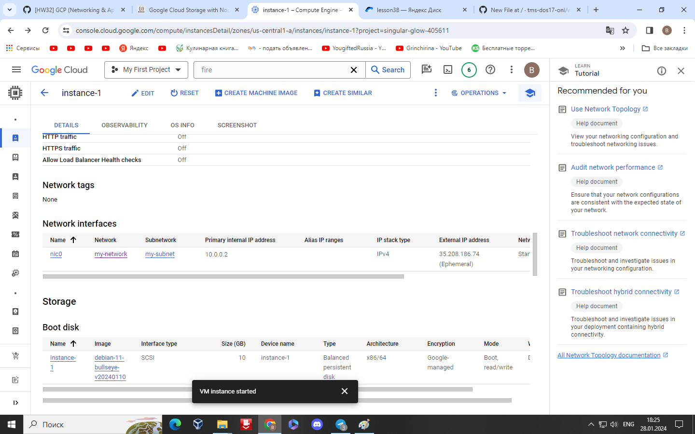
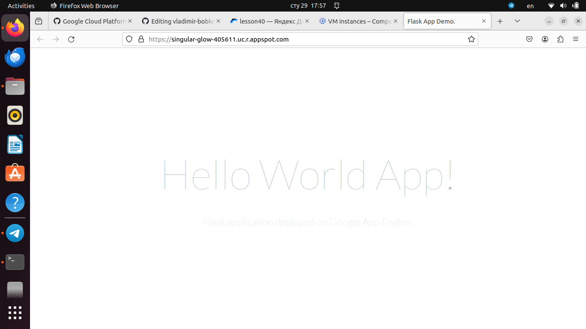
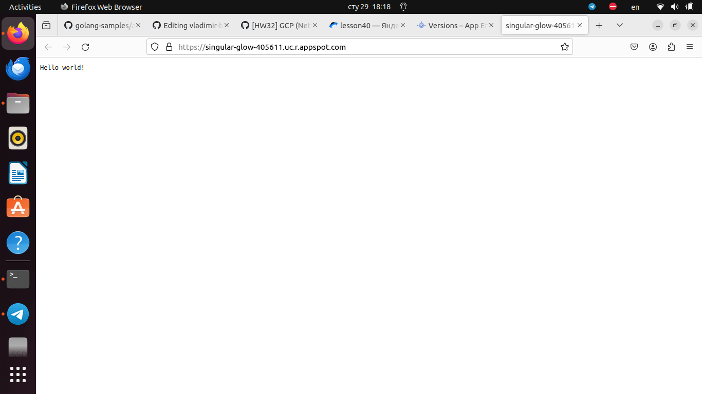

## 1.  Создать Firewall правило DenyAll с низким приоритетом, которое блокирует трафик из любой сети в любую сеть на любом порту. Включить логирование для этого правила.

## 2. Зайти в Logs Storage и активировать опцию Log Analytics для _Default Log bucket.

## 3. Создать 2 VM в одной сети, но разных подсетях.

## 4. Выполнить ping одной VM из другой. В случае, если ping не работает, посмотреть логи. Сделать так, чтобы ping работал 😊
---
    babaika_ko@instance-1:~$ ping 10.194.0.2
      PING 10.194.0.2 (10.194.0.2) 56(84) bytes of data.
      ^C
      --- 10.194.0.2 ping statistics ---
      174 packets transmitted, 0 received, 100% packet loss, time 177116ms
      Удалил правило
      babaika_ko@instance-1:~$ ping 10.194.0.2
      PING 10.194.0.2 (10.194.0.2) 56(84) bytes of data.
      64 bytes from 10.194.0.2: icmp_seq=1 ttl=64 time=149 ms
      64 bytes from 10.194.0.2: icmp_seq=2 ttl=64 time=148 ms
      64 bytes from 10.194.0.2: icmp_seq=3 ttl=64 time=148 ms
      64 bytes from 10.194.0.2: icmp_seq=4 ttl=64 time=148 ms
      64 bytes from 10.194.0.2: icmp_seq=5 ttl=64 time=148 ms
  ---
## 5. Создать новую сеть и подсеть в том регионе, где была создана одна из VM, и перенести эту VM в созданную подсеть новой сети. Иными словами, поменять/добавить этой VM сетевой интерфейс.

## 6.Выполнить ping этой VM из ранее созданной. В случае, если ping не работает, посмотреть логи.
---
  удалил правило. логи не посмотришь(
---
## 7.Настроить пиринг между сетями. Снова попробовать пинг, снова посмотреть логи. Сделать так, чтобы ping работал.
## 8. Найти пример приложения для App Engine Standard Environment и установить его.
---
    git clone https://github.com/Kamparia/google-app-engine-sample.git
    Cloning into 'google-app-engine-sample'...
    remote: Enumerating objects: 52, done.
    remote: Counting objects: 100% (52/52), done.
    remote: Compressing objects: 100% (32/32), done.
    remote: Total 52 (delta 17), reused 43 (delta 12), pack-reused 0
    Receiving objects: 100% (52/52), 14.12 KiB | 89.00 KiB/s, done.
    Resolving deltas: 100% (17/17), done.vanadiy@vanadiy:~/google-app-engine-sample$ gcloud app deploy
    Services to deploy:
    
    descriptor:                  [/home/vanadiy/google-app-engine-sample/app.yaml]
    source:                      [/home/vanadiy/google-app-engine-sample]
    target project:              [singular-glow-405611]
    target service:              [default]
    target version:              [20240129t175235]
    target url:                  [https://singular-glow-405611.uc.r.appspot.com]
    target service account:      [singular-glow-405611@appspot.gserviceaccount.com]
    
    
    Do you want to continue (Y/n)?  y
    
    Beginning deployment of service [default]...
    Created .gcloudignore file. See `gcloud topic gcloudignore` for details.
    ╔════════════════════════════════════════════════════════════╗
    ╠═ Uploading 8 files to Google Cloud Storage                ═╣
    ╚════════════════════════════════════════════════════════════╝
    File upload done.
    Updating service [default]...done.                                                                                  
    Setting traffic split for service [default]...done.                                                                 
    Deployed service [default] to [https://singular-glow-405611.uc.r.appspot.com]
    
    You can stream logs from the command line by running:
      $ gcloud app logs tail -s default

    To view your application in the web browser run:
      $ gcloud app browse
---

## 3. Найти пример приложения для App Engine Flexible Environment и установить его.
---
    vanadiy@vanadiy:~/golang-samples/appengine_flexible$ gcloud app deploy
    Services to deploy:
    
    descriptor:                  [/home/vanadiy/golang-samples/appengine_flexible/app.yaml]
    source:                      [/home/vanadiy/golang-samples/appengine_flexible]
    target project:              [singular-glow-405611]
    target service:              [default]
    target version:              [20240129t181139]
    target url:                  [https://singular-glow-405611.uc.r.appspot.com]
    target service account:      [singular-glow-405611@appspot.gserviceaccount.com]
    
    
    Do you want to continue (Y/n)?  y
    
    Enabling service [appengineflex.googleapis.com] on project [singular-glow-405611]...
    Operation "operations/acf.p2-1025308960645-47a1d808-3127-4fac-9982-63c9c4a83464" finished successfully.
    Beginning deployment of service [default]...
    ╔════════════════════════════════════════════════════════════╗
    ╠═ Uploading 4 files to Google Cloud Storage                ═╣
    ╚════════════════════════════════════════════════════════════╝
    File upload done.
    Updating service [default] (this may take several minutes)...done.                                                  
    ------------------------------------------------ REMOTE BUILD OUTPUT       -------------------------------------------
    starting build "b382c4f2-8921-49a5-b1a7-3cadf2869cf4"
---

    
        

