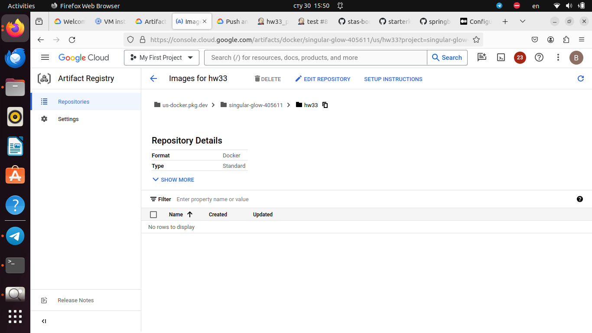

## 1. Создать вручную или через Packer образ VM с установленным Docker.
## 2. Настроить интеграцию Jenkins с GCP для создания агентов из этого образа.
## 3. Найти любое веб-приложение, которое мы вы хотели бы развернуть в облаке.
## 4. Реализовать pipeline, который:
- собирает Docker образ для приложения.
- публикует собранный образа в Google Container Registry.
- развертывает приложение в App Engine Flexible Environment из собранного образа с помощью gcloud app deploy --image-url=[HOSTNAME]/[PROJECT-ID]/[IMAGE].
---
	pipeline {
    agent { 
        label 'gcp'
    }
    stages {
        stage('Clone') {
            steps {
               sh "rm -rf ./springboot-starterkit"
               sh 'git clone https://github.com/josephrodriguez/springboot-starterkit.git'
               sh 'ls -la'
                 }
            }
        stage('Build') {
            steps {
            dir('springboot-starterkit') {    
            sh '''
                echo '
                runtime: custom \n\
                env: flex' > app.yaml
                echo '
                FROM amazoncorretto:21.0.1 as build \n\
                COPY . /usr/app \n\
                WORKDIR /usr/app \n\
                RUN chmod +x mvnw \n\
                RUN ./mvnw clean package \n\
                FROM amazoncorretto:21.0.1-alpine3.18 \n\
                RUN mkdir /app \n\
                COPY --from=build /usr/app/target/*.jar /app/springboot-starterkit.jar \n\
                ENTRYPOINT ["java", "-jar", "/app/springboot-starterkit.jar"]' > Dockerfile
                docker build -t us-docker.pkg.dev/singular-glow-405611/hw33/springboot-starterkit .
                gcloud auth configure-docker us-docker.pkg.dev
                docker push us-docker.pkg.dev/singular-glow-405611/hw33/springboot-starterkit
                gcloud app deploy --image-url=us-docker.pkg.dev/singular-glow-405611/hw33/
                '''
                }
            }    
        }
        
    }
	}
---

