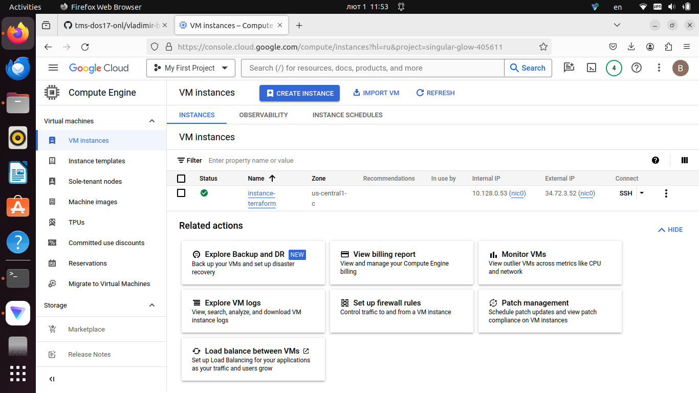

## 1. Установить Terraform.
---
  babaika_ko@instance-1:~$ terraform version
  Terraform v1.7.2
  on linux_amd64
## 2. Написать шаблон для создания виртуальной машины в облаке.
## 3. Познакомиться с командами:
- terraform init
---
      babaika_ko@instance-1:~/terraform-project$ terraform init
    
    Initializing the backend...
    
    Initializing provider plugins...
    - Finding latest version of hashicorp/google...
    - Installing hashicorp/google v5.14.0...
    - Installed hashicorp/google v5.14.0 (signed by HashiCorp)
    
    Terraform has created a lock file .terraform.lock.hcl to record the provider
    selections it made above. Include this file in your version control repository
    so that Terraform can guarantee to make the same selections by default when
    you run "terraform init" in the future.
    
    Terraform has been successfully initialized!
    
    You may now begin working with Terraform. Try running "terraform plan" to see
    any changes that are required for your infrastructure. All Terraform commands
    should now work.
    
    If you ever set or change modules or backend configuration for Terraform,
    rerun this command to reinitialize your working directory. If you forget, other
    commands will detect it and remind you to do so if necessary.
---
- terraform fmt
---
    babaika_ko@instance-1:~/terraform-project$ terraform fmt
    main.tf
    variables.tf
---
- terraform validate
---
    babaika_ko@instance-1:~/terraform-project$ terraform validate
    Success! The configuration is valid.
---
- terraform plan
---
    vanadiy@vanadiy:~/terraform-project$ terraform plan

Terraform used the selected providers to generate the following execution plan. Resource actions are indicated with the
following symbols:
  + create

Terraform will perform the following actions:

    # google_compute_instance.vm_instance will be created
  + resource "google_compute_instance" "vm_instance" {
      + can_ip_forward       = false
      + cpu_platform         = (known after apply)
      + current_status       = (known after apply)
      + deletion_protection  = false
      + effective_labels     = (known after apply)
      + guest_accelerator    = (known after apply)
      + id                   = (known after apply)
      + instance_id          = (known after apply)
      + label_fingerprint    = (known after apply)
      + machine_type         = "e2-standard-2"
      + metadata_fingerprint = (known after apply)
      + min_cpu_platform     = (known after apply)
      + name                 = "instance-terraform"
      + project              = "singular-glow-405611"
      + self_link            = (known after apply)
      + tags_fingerprint     = (known after apply)
      + terraform_labels     = (known after apply)
      + zone                 = "us-central1-c"

      + boot_disk {
          + auto_delete                = true
          + device_name                = (known after apply)
          + disk_encryption_key_sha256 = (known after apply)
          + kms_key_self_link          = (known after apply)
          + mode                       = "READ_WRITE"
          + source                     = (known after apply)

          + initialize_params {
              + image                  = "debian-cloud/debian-11"
              + labels                 = (known after apply)
              + provisioned_iops       = (known after apply)
              + provisioned_throughput = (known after apply)
              + size                   = (known after apply)
              + type                   = (known after apply)
            }
        }

      + network_interface {
          + internal_ipv6_prefix_length = (known after apply)
          + ipv6_access_type            = (known after apply)
          + ipv6_address                = (known after apply)
          + name                        = (known after apply)
          + network                     = "default"
          + network_ip                  = (known after apply)
          + stack_type                  = (known after apply)
          + subnetwork                  = (known after apply)
          + subnetwork_project          = (known after apply)

          + access_config {
              + nat_ip       = (known after apply)
              + network_tier = (known after apply)
            }
        }
    }

Plan: 1 to add, 0 to change, 0 to destroy.

---
- terraform apply
---
    vanadiy@vanadiy:~/terraform-project$ terraform apply

Terraform used the selected providers to generate the following execution plan. Resource actions are indicated with the
following symbols:
  + create

Terraform will perform the following actions:

    # google_compute_instance.vm_instance will be created
  + resource "google_compute_instance" "vm_instance" {
      + can_ip_forward       = false
      + cpu_platform         = (known after apply)
      + current_status       = (known after apply)
      + deletion_protection  = false
      + effective_labels     = (known after apply)
      + guest_accelerator    = (known after apply)
      + id                   = (known after apply)
      + instance_id          = (known after apply)
      + label_fingerprint    = (known after apply)
      + machine_type         = "e2-standard-2"
      + metadata_fingerprint = (known after apply)
      + min_cpu_platform     = (known after apply)
      + name                 = "instance-terraform"
      + project              = "singular-glow-405611"
      + self_link            = (known after apply)
      + tags_fingerprint     = (known after apply)
      + terraform_labels     = (known after apply)
      + zone                 = "us-central1-c"

      + boot_disk {
          + auto_delete                = true
          + device_name                = (known after apply)
          + disk_encryption_key_sha256 = (known after apply)
          + kms_key_self_link          = (known after apply)
          + mode                       = "READ_WRITE"
          + source                     = (known after apply)

          + initialize_params {
              + image                  = "debian-cloud/debian-11"
              + labels                 = (known after apply)
              + provisioned_iops       = (known after apply)
              + provisioned_throughput = (known after apply)
              + size                   = (known after apply)
              + type                   = (known after apply)
            }
        }

      + network_interface {
          + internal_ipv6_prefix_length = (known after apply)
          + ipv6_access_type            = (known after apply)
          + ipv6_address                = (known after apply)
          + name                        = (known after apply)
          + network                     = "default"
          + network_ip                  = (known after apply)
          + stack_type                  = (known after apply)
          + subnetwork                  = (known after apply)
          + subnetwork_project          = (known after apply)

          + access_config {
              + nat_ip       = (known after apply)
              + network_tier = (known after apply)
            }
        }
    }

Plan: 1 to add, 0 to change, 0 to destroy.

Do you want to perform these actions?
  Terraform will perform the actions described above.
  Only 'yes' will be accepted to approve.

  Enter a value: yes

    google_compute_instance.vm_instance: Creating...
    google_compute_instance.vm_instance: Still creating... [10s elapsed]
    google_compute_instance.vm_instance: Creation complete after 17s [id=projects/singular-glow-405611/zones/us-            central1-c/instances/instance-terraform]
---

- terraform destroy
---
  vanadiy@vanadiy:~/terraform-project$ terraform destroy
google_compute_instance.vm_instance: Refreshing state... [id=projects/singular-glow-405611/zones/us-central1-c/instances/instance-terraform]

Terraform used the selected providers to generate the following execution plan. Resource actions are indicated with the
following symbols:
  - destroy

Terraform will perform the following actions:

    # google_compute_instance.vm_instance will be destroyed
  - resource "google_compute_instance" "vm_instance" {
      - can_ip_forward       = false -> null
      - cpu_platform         = "Intel Broadwell" -> null
      - current_status       = "RUNNING" -> null
      - deletion_protection  = false -> null
      - effective_labels     = {} -> null
      - enable_display       = false -> null
      - guest_accelerator    = [] -> null
      - id                   = "projects/singular-glow-405611/zones/us-central1-c/instances/instance-terraform" -> null
      - instance_id          = "345059784528422230" -> null
      - label_fingerprint    = "42WmSpB8rSM=" -> null
      - labels               = {} -> null
      - machine_type         = "e2-standard-2" -> null
      - metadata             = {} -> null
      - metadata_fingerprint = "-T0VRQA_q4g=" -> null
      - name                 = "instance-terraform" -> null
      - project              = "singular-glow-405611" -> null
      - resource_policies    = [] -> null
      - self_link            = "https://www.googleapis.com/compute/v1/projects/singular-glow-405611/zones/us-central1-c/instances/instance-terraform" -> null
      - tags                 = [] -> null
      - tags_fingerprint     = "42WmSpB8rSM=" -> null
      - terraform_labels     = {} -> null
      - zone                 = "us-central1-c" -> null

      - boot_disk {
          - auto_delete = true -> null
          - device_name = "persistent-disk-0" -> null
          - mode        = "READ_WRITE" -> null
          - source      = "https://www.googleapis.com/compute/v1/projects/singular-glow-405611/zones/us-central1-c/disks/instance-terraform" -> null

          - initialize_params {
              - enable_confidential_compute = false -> null
              - image                       = "https://www.googleapis.com/compute/v1/projects/debian-cloud/global/images/debian-11-bullseye-v20240110" -> null
              - labels                      = {} -> null
              - provisioned_iops            = 0 -> null
              - provisioned_throughput      = 0 -> null
              - resource_manager_tags       = {} -> null
              - size                        = 10 -> null
              - type                        = "pd-standard" -> null
            }
        }

      - network_interface {
          - internal_ipv6_prefix_length = 0 -> null
          - name                        = "nic0" -> null
          - network                     = "https://www.googleapis.com/compute/v1/projects/singular-glow-405611/global/networks/default" -> null
          - network_ip                  = "10.128.0.53" -> null
          - queue_count                 = 0 -> null
          - stack_type                  = "IPV4_ONLY" -> null
          - subnetwork                  = "https://www.googleapis.com/compute/v1/projects/singular-glow-405611/regions/us-central1/subnetworks/default" -> null
          - subnetwork_project          = "singular-glow-405611" -> null

          - access_config {
              - nat_ip       = "34.72.3.52" -> null
              - network_tier = "PREMIUM" -> null
            }
        }

      - scheduling {
          - automatic_restart   = true -> null
          - min_node_cpus       = 0 -> null
          - on_host_maintenance = "MIGRATE" -> null
          - preemptible         = false -> null
          - provisioning_model  = "STANDARD" -> null
        }

      - shielded_instance_config {
          - enable_integrity_monitoring = true -> null
          - enable_secure_boot          = false -> null
          - enable_vtpm                 = true -> null
        }
    }

Plan: 0 to add, 0 to change, 1 to destroy.

Do you really want to destroy all resources?
  Terraform will destroy all your managed infrastructure, as shown above.
  There is no undo. Only 'yes' will be accepted to confirm.

  Enter a value: yes

google_compute_instance.vm_instance: Destroying... [id=projects/singular-glow-405611/zones/us-central1-c/instances/instance-terraform]
google_compute_instance.vm_instance: Still destroying... [id=projects/singular-glow-405611/zones/us-central1-c/instances/instance-terraform, 10s elapsed]
google_compute_instance.vm_instance: Still destroying... [id=projects/singular-glow-405611/zones/us-central1-c/instances/instance-terraform, 20s elapsed]
google_compute_instance.vm_instance: Still destroying... [id=projects/singular-glow-405611/zones/us-central1-c/instances/instance-terraform, 30s elapsed]
google_compute_instance.vm_instance: Still destroying... [id=projects/singular-glow-405611/zones/us-central1-c/instances/instance-terraform, 40s elapsed]
google_compute_instance.vm_instance: Still destroying... [id=projects/singular-glow-405611/zones/us-central1-c/instances/instance-terraform, 50s elapsed]
google_compute_instance.vm_instance: Destruction complete after 58s

    Destroy complete! Resources: 1 destroyed.
---

## 4. Создать виртуальную машину в облаке при помощи ранее созданного шаблона.
---
    создал
---
  
## 5. Поменять тип виртуальной машины (увеличить количество ресурсов) через веб консоль и выполнить terraform plan. Что предлагает сделать Terraform?
---
  vanadiy@vanadiy:~/terraform-project$ terraform plan
google_compute_instance.vm_instance: Refreshing state... [id=projects/singular-glow-405611/zones/us-central1-c/instances/instance-terraform]

Terraform used the selected providers to generate the following execution plan. Resource actions are indicated with the
following symbols:
  ~ update in-place

Terraform will perform the following actions:

    # google_compute_instance.vm_instance will be updated in-place
  ~ resource "google_compute_instance" "vm_instance" {
        id                   = "projects/singular-glow-405611/zones/us-central1-c/instances/instance-terraform"
      ~ machine_type         = "e2-standard-2" -> "e2-medium"
        name                 = "instance-terraform"
        tags                 = []
        # (18 unchanged attributes hidden)

        # (4 unchanged blocks hidden)
    }

    Plan: 0 to add, 1 to change, 0 to destroy.
---
