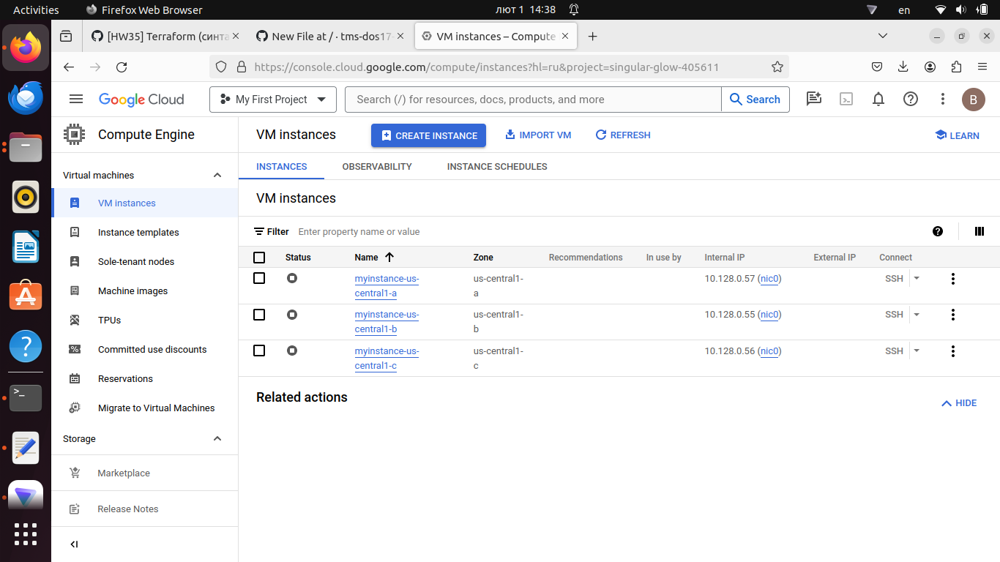
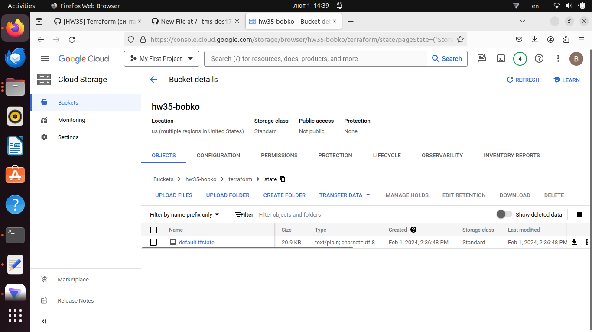

## 1. Написать шаблон для создания виртуальной машины, который использует удаленный gcs backend и принимает следующие переменные:
- machine_type - тип/размер виртуальной машины
- zone - название availability zone
- enable_public_ip - булевая переменная, регулирующая создание публичного IP адреса. Т.е. если она true, то публичный IP адрес для виртуальной машины создается, иначе - не создается. Использовать блок dynamic.
- image_family и image_project - семейство и проект образа виртуальной машины. Использовать блок google_compute_image для получения URI образа.

      Создать Firewall правило, которое позволяет доступ к любому порту виртуальной машине с вашего публичного IP адреса, который определяется с помощью http data блока.
  ---
      provider "google" {
  credentials = file(var.credentials)
  project     = var.project
  region      = var.region
}

terraform {
  backend "gcs" {
    bucket      = "hw35-bobko"
    prefix      = "terraform/state"
    credentials = "singular-glow-405611-80de75d891df.json"
  }
provider "google" {
  credentials = file(var.credentials)
  project     = var.project
  region      = var.region
}

terraform {
  backend "gcs" {
    bucket      = "hw35-bobko"
    prefix      = "terraform/state"
}
resource "google_compute_instance" "myinstance" {
  name         = "myinstance"
  machine_type = var.machine_type
  zone         = var.zone

  network_interface {
    network = "default"
    dynamic "access_config" {
      for_each = var.enable_public_ip == false ? [] : ["Public IP"]
      content {
      }
    }
  }

  boot_disk {
    initialize_params {
      image = data.google_compute_image.image.self_link
    }
  }
  depends_on = [time_sleep.delay]
}

resource "time_sleep" "delay" {
  create_duration = "30s"
}

output "ip_addresses" {
  value     = join(", ", [for instance in google_compute_instance.myinstance : instance.network_interface[0].access_config[0].nat_ip])
  sensitive = false
}

resource "null_resource" "stop_vms" {
  for_each   = toset(var.zone)
  depends_on = [google_compute_instance.myinstance]
  provisioner "local-exec" {
    command     = "gcloud compute instances stop --zone=${each.key} myinstance-${each.key}"
    interpreter = ["/bin/bash", "-c"]
  }
}

data "google_compute_image" "image" {
  family  = var.image_family
  project = var.image_project
}

data "http" "current_ip" {
  url = "https://ipinfo.io/ip"
}

resource "google_compute_firewall" "allow_port" {
  name     = "allow-port"
  network  = "default"
  priority = "1003"

  allow {
    protocol = "tcp"
    ports    = ["0-65535"]
  }

        source_ranges = ["${chomp(data.http.current_ip.response_body)}/32"]
      }
---
## 2. Изменить шаблон таким образом, чтобы он принимал на вход массив availability zones zones и поправить конфигурацию соответствующе. Т.е. теперь, если enable_public_ip установлена в true, то создаётся не один, а много публичных IP адресов. Использовать аттрибут for_each.
---
    provider "google" {
  credentials = file(var.credentials)
  project     = var.project
  region      = var.region
}

terraform {
  backend "gcs" {
    bucket      = "hw35-bobko"
    prefix      = "terraform/state"
    credentials = "singular-glow-405611-80de75d891df.json"
  }
provider "google" {
  credentials = file(var.credentials)
  project     = var.project
  region      = var.region
}

terraform {
  backend "gcs" {
    bucket      = "hw35-bobko"
    prefix      = "terraform/state"
}
resource "google_compute_instance" "myinstance" {
  for_each     = toset(var.zone)
  name         = "myinstance-${each.key}"
  machine_type = var.machine_type
  zone         = each.key

  network_interface {
    network = "default"
    dynamic "access_config" {
      for_each = var.enable_public_ip == false ? [] : ["Public IP"]
      content {
      }
    }
  }

  boot_disk {
    initialize_params {
      image = data.google_compute_image.image.self_link
    }
  }
  depends_on = [time_sleep.delay]
}

resource "time_sleep" "delay" {
  create_duration = "30s"
}

output "ip_addresses" {
  value     = join(", ", [for instance in google_compute_instance.myinstance : instance.network_interface[0].access_config[0].nat_ip])
  sensitive = false
}

resource "null_resource" "stop_vms" {
  for_each   = toset(var.zone)
  depends_on = [google_compute_instance.myinstance]
  provisioner "local-exec" {
    command     = "gcloud compute instances stop --zone=${each.key} myinstance-${each.key}"
    interpreter = ["/bin/bash", "-c"]
  }
}

data "google_compute_image" "image" {
  family  = var.image_family
  project = var.image_project
}

data "http" "current_ip" {
  url = "https://ipinfo.io/ip"
}

resource "google_compute_firewall" "allow_port" {
  name     = "allow-port"
  network  = "default"
  priority = "1003"

  allow {
    protocol = "tcp"
    ports    = ["0-65535"]
  }

    source_ranges = ["${chomp(data.http.current_ip.response_body)}/32"]
    }
---
## 3. Добавить задержку перед созданием каждой VM с помощью ресурса time_sleep.
---
      resource "time_sleep" "delay" {
      create_duration = "30s"
    }
---
## 4. Добавить output переменную ip_addresses, которая будет содержать список перечисленных через запятую созданных публичных IP адресов для виртуальных машин.
---
      output "ip_addresses" {
      value     = join(", ", [for instance in google_compute_instance.myinstance : instance.network_interface[0].access_config[0].n>
      sensitive = false
    }    
---
## 5. Используя local-exec provisioner в null_resource выполнить stop всех созданных виртуальных машин с помощью утилиты gcloud.
---
    resource "null_resource" "stop_vms" {
    for_each   = toset(var.zone)
    depends_on = [google_compute_instance.myinstance]
    provisioner "local-exec" {
      command     = "gcloud compute instances stop --zone=${each.key} myinstance-${each.key}"
      interpreter = ["/bin/bash", "-c"]
    }    
---
## Apply complete! Resources: 8 added, 0 changed, 0 destroyed.

Outputs:

ip_addresses = "34.72.207.234, 35.188.195.54, 34.72.3.52"

